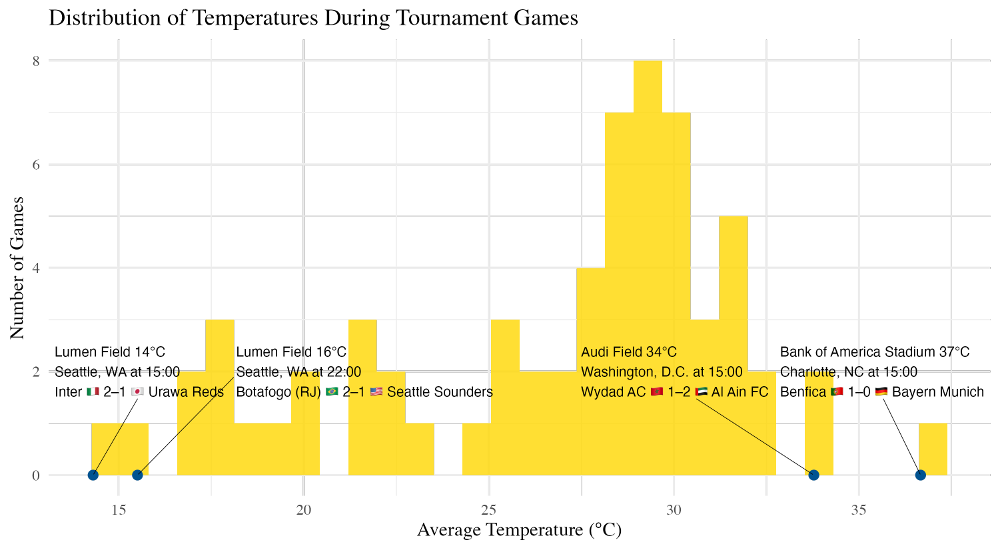
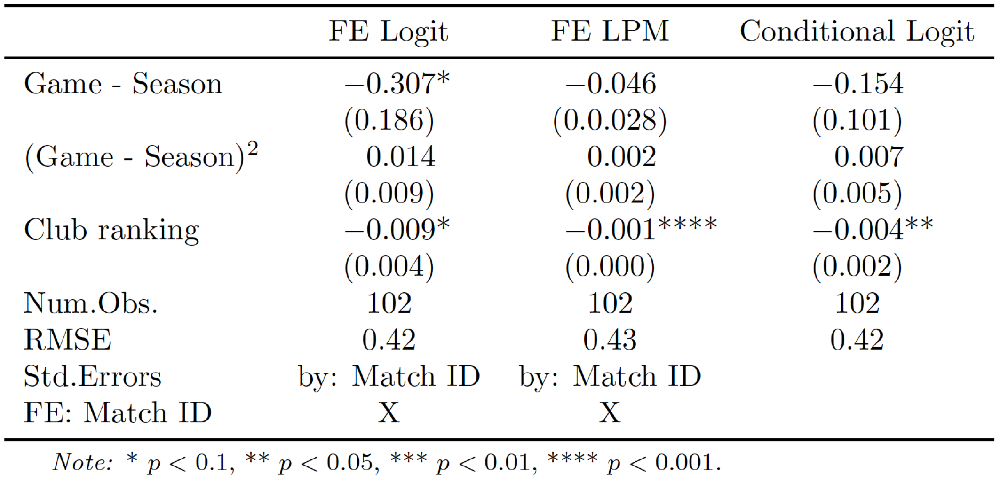

The new edition of the club world cup ended about a month ago. This new edition saw the team pool expand to 32 teams spanning all football federations, which made for once-in-a-lifetime match-ups, the kind you would only see in preseason friendlies; Esperance de Tunis goes up against London-based Chelsea, Rio de Janiero's Flamengo, or Los Angeles Football Club. 

Since club football is different from national football, where teams only have nationals representing the country, this also presented the competition with an opportunity to showcase players from all over the world. Across all teams, players from 73 countries represented 32 teams coming from 20 different leagues and 6 different football federations. The top countries are, of course, Brazil and Argentina. This is because both countries produce a large number of professional footballers in the world (besides the fact that both countries had 4 and 2 teams in the competition each). 

Since club football is different from national football, where teams only have nationals representing the country, this also presented the competition with an opportunity to showcase players from all over the world. Across all teams, players from 73 countries represented 32 teams coming from 20 different leagues and 6 different football federations. The top countries are, of course, Brazil and Argentina. This is because both countries produce a large number of professional footballers in the world (besides the fact that both countries had 4 and 2 teams in the competition each). 

Another omnipresent point in this year's edition, which served as a training ground for North America's 2026 natonal teams world cup edition, is the weather challenges across the competition. That is, the sweltering heat that hit the country earlier this summer. The temperature ranged from a Seattle game under a pleasant 15°C (59°F) to a whopping 37°c(98.6°F) in a humid Miami. The adaptation capacity across venues differed. Some stadiums, like the Mercedes-Benz stadium in Atlanta, includes a retractable roof where temperature inside the stadium can be controlled. 

The sweltering heat resulted in scheduled water breaks that divided the two halves into further two to give the players the chance to hydrate. Heat was not the only climatic factor affecting the games, some games were delayed due to thunderstorms in the vicinity of the venues. This lead to an angry Maresca (Chelsea FC manager) in post-game interview criticizing the handling of the game management. 

As I followed the competition I was wondering if such heat was having an impact on their performance. After all, existing research shows that <a href="https://www.nber.org/papers/w31650"> temperature affects performance and injuries in Tennis</a> , <a href="https://journals.ametsoc.org/view/journals/bams/104/5/BAMS-D-22-0235.1.xml"> home runs in baseball</a> , and even <a href="https://www.sciencedirect.com/science/article/abs/pii/S0959652624015282"> soccer performance in the Chinese Soccer Super league</a>. To investigate this question, I processed the average temperature data during the games and looked at the impact of temperature on goals and number of cards handed (both yellow and red). The hypotheses for these two outcomes follow the logic of temperature's effect on performance (where temperature impacts effort and amount of errors), and temperature impacts on violence. In order to test these hypotheses, I ran a fixed effects model with a function of temperature constituting of average temperature and a squared term of temperature. The fixed effects for the player-level dataset is at the player level (since temperature varies across games). I also include regular season performance for each of the players (specifically, average xG and xAG for goals model and total regualr season cards for cards model). I re did the analysis but this time at the team level (with team FEs). Given that the competition data is relatively small, it is hard to infer a lot from these results. Regardless, I do observe a non-linear effect of temperature on number of goals (at the player-match level). While this effect is statistically significant, it is not contextually meaningful. 

On the second question of whether recent temperature exposure of a team relative to game temperature serves as an advantage, I collected regular season average temperature for the most recent season for all teams to investigate the effect of temperature deviation from regular season average on probability of winning the game. I fitted a few models appropriate for a case of binary outcomes (in this case which team won the game). The stadiums assigned for a given game is presumably random (at least at each team's regular exposure in home base). I do include the club's world ranking as an explanatory variable here. Evidence is not very strong but is suggestive of positive effect on winning probability if average temperature exposure in regular season is higher than game temperature (and conversely colder average exposure does seem to contribute negatively to probability). 

Specifically, the probit and logit models below include a game fixed effects so that we are comparing both teams matched against each other in the game. I also fit a conditional logit model (stratified by game). below is a table with results. 

It seems like the chatter we heard about the role of temperature in this edition of the club world cup will continue into the world cup next year. This compeition also saw some players express concern at plating in high temperature. So it is interesting to see how that affects the FIFA/FIFPRO debate where players are raising concern for increasingly busy schedules. 

In the meantime here is every goal scored from this summer's competition:

<iframe width="1120" height="515" src="https://www.youtube.com/embed/q5GhGFpK8N4" frameborder="0" allowfullscreen></iframe>

