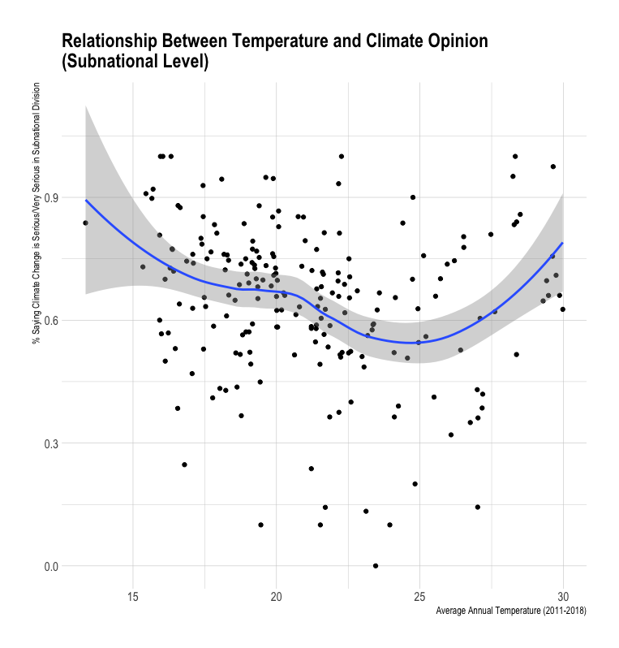
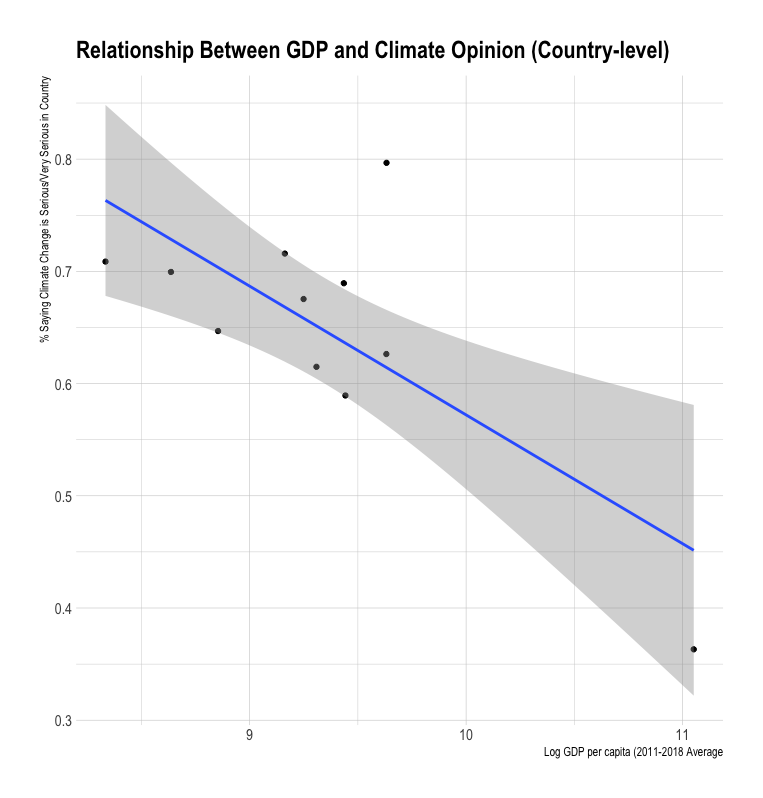

A couple of months ago, I came across an email from the Arab Barometer series of summary results from their  <a href="https://www.arabbarometer.org/surveys/arab-barometer-wave-v/">2018-2019 fifth wave survey </a>. It was from the newly added questions on the public opinion regarding environmental issues, specifically water pollution, climate change, and waste. The results indicated that although there is differences between countries, there is no difference across demographic characteristics. So I wondered what are the determinants of climate opinion in the Arab world?

<b> Climate Change and the Arab World </b>  
Ramifications of climate change have been taking place around the world for years now. The Arab world stands to be one of the most affected by climate change and its ramifications(<a href="https://www.youtube.com/embed/LfLcdTEInLk">wildfires</a>, <a href="https://www.youtube.com/watch?v=Vo61TiAGwhk">locust epidemics</a>,..,etc.), given its arid and semi-arid environment. Ramifications of climate change can materialize in a host of ways. For example, increase in extreme weather events, or shifting precipitation patterns. Such changes in the natural system can have a big impact on the social outcomes of the communities residing in affected areas. 

<b>	Climate opinion in the Arab World </b>  
Around 65% of respondents say that climate change is serious/very serious issue. There is considerable variation in between countries and within in climate change as seen in the below figures.

<b>	Can temperature shape opinion? </b>  
Let’s take the temperature for example. The data shows a steady increase in average yearly temperature from the start of the century up to 2016. There is growing evidence from multiple studies on the negative impacts of increased temperature in a multitude of outcomes (health, education, etc.). When looking at a plot of average temperature in the last decade and climate opinion at the subnational level, there is a u-shaped relationship, where lowest and highest average temperature divisions have a higher percentage of people saying climate change is a serious issue. 

<b>Wealthier countries might be more capable to adapt </b>  
Adaptation and mitigation are two approaches in the face of climate change taken by institutions to lessen the intensity of climate change or its impact on people's lives. Wealthier nations might have a bigger capacity to take on adaptation policies High capacity to adapt to high temperature or extreme shifting weather patterns combined with a low percentage of dependence on agriculture for livelihood can lead to minimal direct exposure to ramifications of climate change. 

 
 <b> Drought in Al Bekaa Valley </b>  
35 percent of Lebanon’s land is cultivated, and half of that land is in the Bekaa region. Most crops in the Bekaa region are rain-fed. Al Bekaa and Mount Lebanon account for almost 40 percent of the number of farm holdings in Lebanon,

The Bekaa Valley represents around 40 percent of the cultivated land in Lebanon. In 2012, agriculture accounted for 15 percent of exports and imports in Lebanon. In areas where most agriculture products are produced, agriculture accounts for 80 percent of GDP. Al Bekaa is Lebanon’s most important farming region. It is also the home of industries that are directly linked to farming. Of the ramifications of climate change that have been affecting the region is the decline in rainfall, leading to increase in drought events.

<b> Wildfires in Mount Lebanon </b>  
The second region with the highest percentage of people believing in the seriousness of climate change is Mount Lebanon. Alongside the agricultural importance of this region, Mount Lebanon has seen several wildfires, most recently in October of last year. Increased occurrence of heatwaves due to climate change, accompanied by drought events, leads to more wildfires like the one witnessed last year.

So for both these regions, we can see how direct exposure to climate change ramifications can affect public opinion. 

<b> Conclusion </b>  
There is not enough data to identify long-term trends in public opinion regarding climate change, and thus better understand determinants of climate opinion. However, potentially, cross-country variation can depend on the capacity to adapt to ramifications of climate change, and that within-country variation can potentially be partly explained by the rate of dependence on agriculture, due to direct exposure to climate change ramifications. 

But does public opinion matter? And why is it important to understand its drivers? Maybe it is not. But aside from the interesting insights that can be deduced from such exercise, it can also teach something about what shapes people's beliefs about certain phenomena such as climate change. And although strong opinion towards climate change does not necessarily translate to action or pressure on actors to bring about certain mitigation policies, it can form a basis for such actions. 
