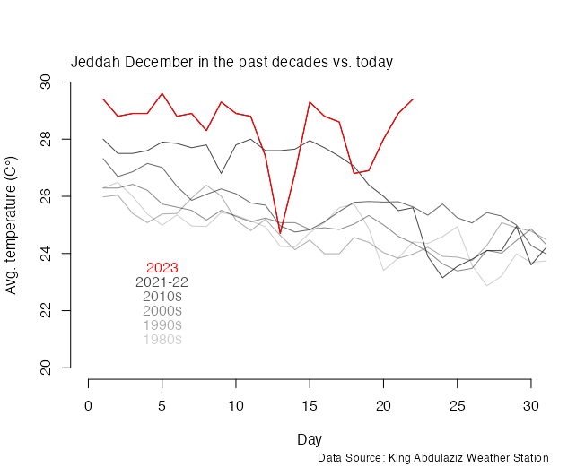
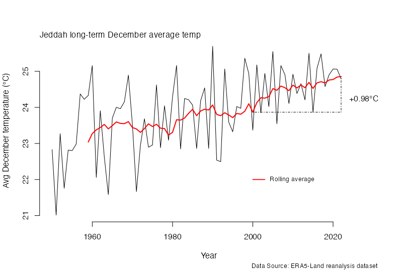
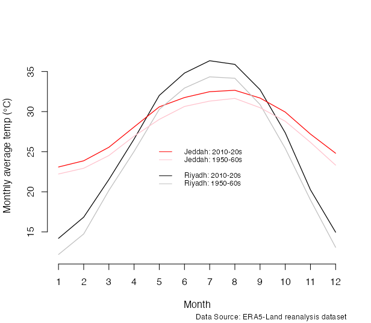

Growing up in Jeddah, December has always been a month of a chillier and nicer weather where my family enjoyed outdoor outings by the corniche or in the backyard grilling corn and chestnuts. The “winter” would last from late November to mid-late February. Over the past decade or so, this period has become less “wintery”.  <a href="https://www.nytimes.com/2023/12/26/climate/global-warming-accelerating.html">Much like rest of the world</a>, average temperature has been rising. This year is not different. We have seen record breaking temperature all over the globe. Jeddah and the region are no different. This December has already seen temperature well above the average in recent decades. 

Since 2000, December average temperature has risen by ~ 1°C. 

Compared to the rest of the country, Jeddah did not witness the highest increases in temperatures when comparing December averages in the 50s and 60s to the average over the past ~13 years. Jeddah only comes at the 43rd percentile in terms of increases in December average temperature (1.48°C). Al Sulayimi in Ha’il province is ranks the highest with a 2.45C increase in average December temperature. Al Harth in Jizan has the lowest increase with 0.45°C increase in average December temperature. 

Looking at the two most populated cities in the Kingdom, both Jeddah and Riyadh have witnessed increases in average monthly temperature throughout the year. The climate profiles for these two cities differs where Riyadh’s desert climate means that winters are much cooler than Jeddah and summers are much hotter. On the other hand, Jeddah’s average temperature does not change as considerably throughout the years and weather is more humid throughout the year. 

What does shifting temperature mean? <a href="https://www.nytimes.com/interactive/2023/08/03/climate/ocean-temperatures-heat-earth.html?action=click&module=RelatedLinks&pgtype=Article">Rising temperatures have a multifaceted impact on earth systems</a>, . This year oceans have also seen numerous heatwaves. Rising ocean temperature can disrupt marine ecosystems. Warming ocean surface temperature could also influence tropical cyclones, etc. <a href="https://www.noaa.gov/noaa-wildfire/wildfire-climate-connection"> temperature can also contribute to increases in wildfire risks</a>. All of these ramifications have downstream impacts on humans and human systems. 

What is driving this? Well, aside from human-induced climate change, other contributing factors include <a href="https://www.climate.gov/news-features/blogs/enso/enso-and-climate-change-what-does-new-ipcc-report-say"> the arrival of Elniño</a>, <a href="https://www.nature.com/articles/d41586-023-02430-x" >rules aimed at limiting air pollution from maritime shipping</a>, and <a href="\https://www.axios.com/2023/08/14/climate-change-heat-wave-causes" > last year's Tonga volcanic eruption. </a> 

Let us hope January and February bring with it a much cooler temperature!
