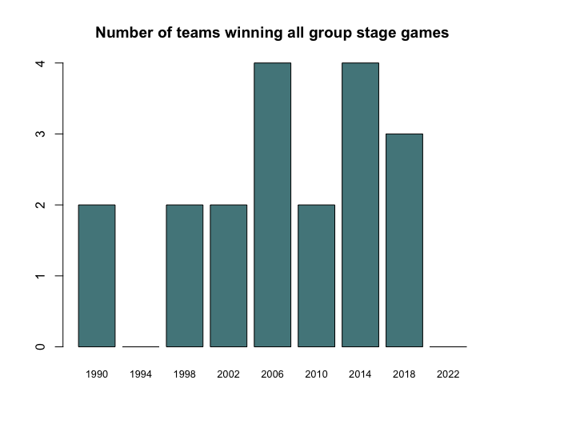

Although it has been two months since the end of the latest edition of the World Cup, the 2022 World Cup, it feels like it was decades ago when we lived through the most thrilling game in modern soccer history. France and Argentina faced off in a ferotious battle that left the whole planet on its toes. Before we got to the historic final, however, we lived through some of the most exciting games full of surprising results. Here is a thread I shared on twitter a day after the group stage ended: 

**NOTE: the following thread was published on 12/02/22

The #WorldCup2022 group stage, which ended yesterday, was one of the most exhilarating in recent history. We were treated to surprises almost on a daily basis! But how does this WC compare to previous editions? Is it more competitive? I was curious, so I took a look.

When we look at the standard deviation of teams’ points within groups, this year’s edition seems to have one of the smallest numbers in recent history (at least since 1990)! In other words, teams were much closer to each other than in previous editions. 

This World Cup also saw the highest % of teams winning at least once, with 85% of teams getting a taste of glory. This is also the first time since the 1994 edition that no team wins all their games!

This WC group stage also recorded the least number of teams avoiding defeat in recent history, with only 5!!!
<blockquote class="twitter-tweet">
¿Cuántos equipos terminaron la fase de grupos sin derrota? (WC con 32 selecciones)  1998: 12 2002: 12 2006: 11 2010: 9 2014: 9 2018: 9 2022: 5 (<a href="https://twitter.com/hashtag/NED?src=hash&amp;ref_src=twsrc%5Etfw">#NED</a> <a href="https://twitter.com/hashtag/ENG?src=hash&amp;ref_src=twsrc%5Etfw">#ENG</a> <a href="https://twitter.com/hashtag/USA?src=hash&amp;ref_src=twsrc%5Etfw">#USA</a> <a href="https://twitter.com/hashtag/MAR?src=hash&amp;ref_src=twsrc%5Etfw">#MAR</a> <a href="https://twitter.com/hashtag/HRV?src=hash&amp;ref_src=twsrc%5Etfw">#HRV</a>)  Era previsible, pero ahora ya es una evidencia: estamos ante la Copa del Mundo más abierta de la historia.
&mdash; MisterChip (Alexis) (@2010MisterChip) <a href="https://twitter.com/2010MisterChip/status/1598790152465354789?ref_src=twsrc%5Etfw">December 2, 2022</a></blockquote> 

Personally, the most exciting part of this WC group stage was seeing African, and Asian (CAF & AFC) teams, in multiple instances, outshine their European and South American (UEFA & CONMEBOL) opponents (who usually have the upper hand at the World Cup)

<blockquote class="twitter-tweet">
Super entertaining <a href="https://twitter.com/FIFAWorldCup?ref_src=twsrc%5Etfw">@FIFAWorldCup</a> group stage - so many qualification twists and turns in the last round of games! I was curious to see how the federations stacked up so I pulled group stage results for the last 7 tournaments and did some analysis. A ⚽️🏆📈 thread 1/n <a href="https://t.co/uAWBsBHfRZ">pic.twitter.com/uAWBsBHfRZ</a>
&mdash; Pierre Biscaye (@pbiscaye) <a href="https://twitter.com/pbiscaye/status/1598804664858071041?ref_src=twsrc%5Etfw">December 2, 2022</a></blockquote> 

Can't wait to see how the rest of this World Cup unfolds! For now, I’m gonna go rewatch all goals from the group stage: 

<iframe width="420" height="315"
src="https://www.youtube.com/watch?v=QL_I_2YRGLk">
</iframe>

